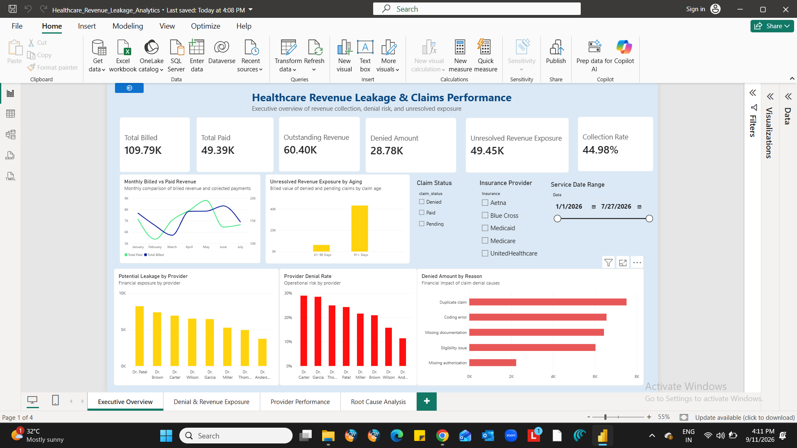
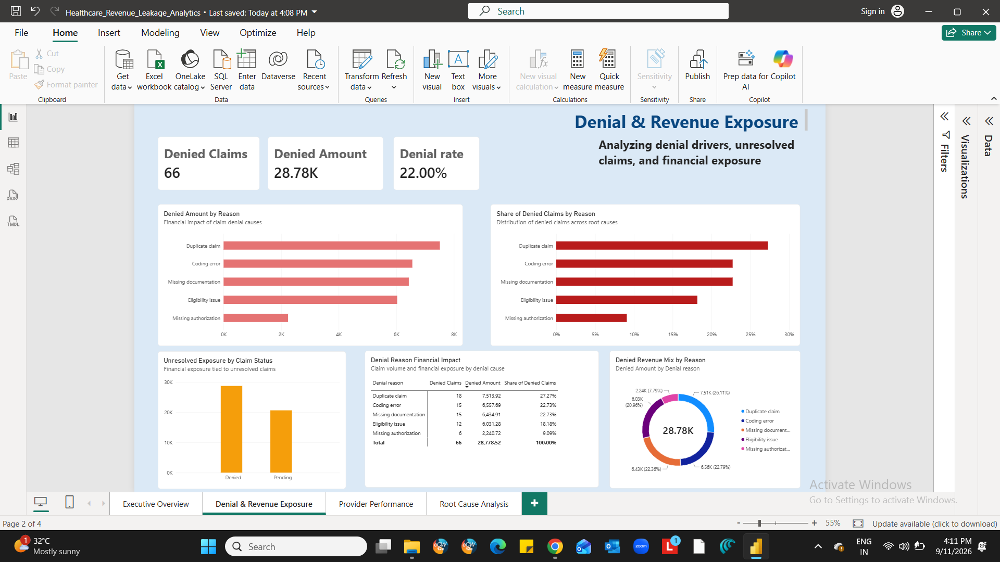
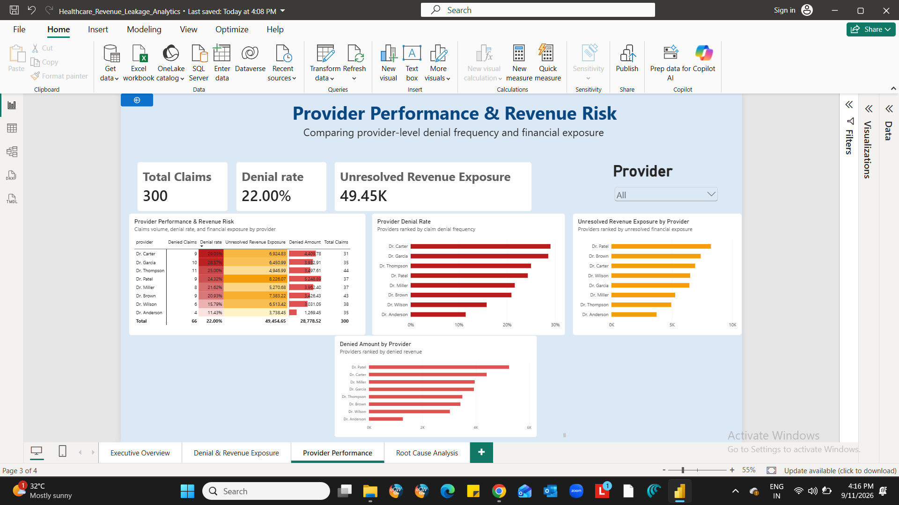
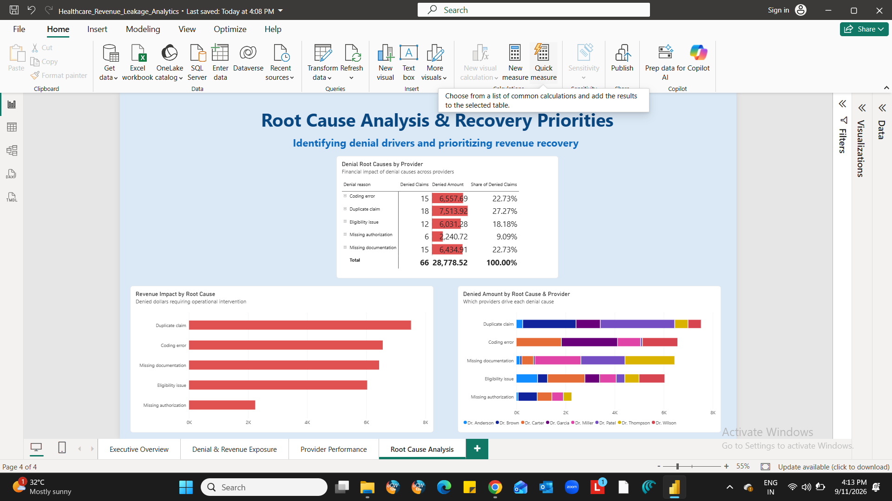

# Healthcare Revenue Leakage & Claims Performance Analytics

## Executive Summary

A healthcare claims and revenue analytics dashboard built in Power BI to identify where billed revenue is delayed, denied, or remains unresolved, and to highlight the operational factors driving financial exposure.

The project is designed as a recruiter-facing portfolio project for Healthcare Data / BI Analyst roles, combining healthcare-domain reasoning with Power BI, DAX, Power Query, data modeling, and analytical storytelling.

## Business Problem

Healthcare organizations can lose cash-flow efficiency when claims are denied, remain pending, or take longer to convert from billed amounts into collected revenue.

This analysis answers:

- How much revenue was billed versus collected?
- What proportion of claims were denied?
- Which denial reasons create the greatest financial exposure?
- Which providers have higher denial rates or larger unresolved exposure?
- How old are unresolved claims?
- Where should revenue-recovery efforts be prioritized?

## Dashboard Structure

### 1. Executive Overview
Provides a high-level view of:

- Total billed revenue
- Total paid revenue
- Outstanding revenue
- Denied amount
- Unresolved revenue exposure
- Collection rate
- Monthly billed versus paid trends
- Unresolved exposure by claim aging
- Provider-level financial exposure
- Provider denial rates
- Denied amount by denial reason

### 2. Denial & Revenue Exposure
Focuses on the financial and operational impact of claim denials:

- Denied amount
- Denied claims
- Denial rate
- Denied amount by reason
- Share of denied claims by reason
- Unresolved exposure by claim status
- Denial-reason financial detail
- Denied revenue mix

### 3. Provider Performance
Compares providers across:

- Total claims
- Denial rate
- Denied claims
- Denied amount
- Unresolved revenue exposure

Conditional formatting highlights higher-risk providers.

### 4. Root Cause Analysis
Connects denial causes with financial impact and providers:

- Denial reason → provider analysis
- Revenue impact by root cause
- Denied amount by root cause and provider
- Recovery-priority analysis

## Key Metrics

| KPI | Definition |
|---|---|
| Total Billed | Sum of claim billed amounts |
| Total Paid | Sum of payment amounts |
| Outstanding Revenue | Total billed minus total paid |
| Denial Rate | Denied claims divided by total claims |
| Denied Amount | Billed value associated with denied claims |
| Pending Amount | Billed value associated with pending claims |
| Unresolved Revenue Exposure | Denied amount plus pending amount |
| Collection Rate | Total paid divided by total billed |

### Important Analytical Definition

**Unresolved Revenue Exposure is not automatically confirmed revenue leakage.**

Denied claims may be recoverable through resubmission or correction, while pending claims may still be collectible. The dashboard therefore uses **Unresolved Revenue Exposure** as the more defensible business term.

## Key Findings

Based on the completed analysis:

- Total billed revenue: **$109,793.27**
- Total paid revenue: **$49,389.71**
- Collection rate: **44.98%**
- Total claims: **300**
- Denied claims: **66**
- Denial rate: **22.00%**
- Denied amount: **$28,778.52**
- Pending amount: **$20,676.13**
- Unresolved revenue exposure: **$49,454.65**
- Potential unresolved exposure represents approximately **45.04% of total billed revenue**.

### Denial Drivers

The largest denied-dollar categories are:

1. Duplicate claim
2. Coding error
3. Missing documentation
4. Eligibility issue
5. Missing authorization

Duplicate claims represent the largest individual denied-dollar category, while coding errors and missing documentation together account for approximately **45% of denied dollars**.

### Provider Risk

Provider analysis shows that financial exposure and denial rate tell different stories.

- **Dr. Carter** has the highest denial rate at approximately **29.03%**.
- **Dr. Patel** has the highest denied amount at approximately **$5,248.89**.
- **Dr. Patel** also has the highest unresolved exposure at approximately **$8,226.07**.

This distinction is important: the provider with the highest denial rate is not necessarily the provider with the greatest financial exposure.

### Aging Risk

Using a fixed reporting cutoff of **September 30, 2026**, most unresolved exposure falls into the **91+ day** aging bucket.

This indicates that older unresolved claims should receive priority in revenue-recovery workflows.

## Data Model

The project uses three primary healthcare tables:

- **Patients** — patient demographics and insurance information
- **Claims** — claim, provider, service date, billed amount, status, and denial reason
- **Payments** — payment transactions and payment timing

A dedicated **DateTable** supports time-based analysis and time-intelligence calculations.

Core model relationships:

```text
Patients
   │
   └── Claims
          │
          └── Payments

DateTable
   │
   └── Claims
```

## DAX Examples

### Collection Rate

```DAX
Collection Rate =
DIVIDE(
    [Total Paid],
    [Total Billed]
)
```

### Denial Rate

```DAX
Denial Rate =
DIVIDE(
    [Denied Claims],
    [Total Claims]
)
```

### Unresolved Revenue Exposure

```DAX
Unresolved Revenue Exposure =
[Denied Amount] + [Pending Amount]
```

### Aging Bucket

```DAX
Claim Aging Bucket =
SWITCH(
    TRUE(),
    Claims[Claim Age Days] <= 30, "0–30 Days",
    Claims[Claim Age Days] <= 60, "31–60 Days",
    Claims[Claim Age Days] <= 90, "61–90 Days",
    "91+ Days"
)
```

### Unresolved Exposure by Claim Status

```DAX
Unresolved Exposure by Claim Status =
CALCULATE(
    [Total Billed],
    KEEPFILTERS(
        Claims[claim_status] IN {"Denied", "Pending"}
    )
)
```

## Analytical Approach

1. Loaded healthcare claims, patient, and payment data into Power BI.
2. Prepared and validated data using Power Query.
3. Built relationships between core fact and dimension tables.
4. Created reusable DAX measures for revenue, claims, denial, collection, and exposure metrics.
5. Added a dedicated DateTable for time analysis.
6. Built aging logic using a fixed reporting cutoff.
7. Analyzed denial reasons and provider performance.
8. Added slicers and filter-context-driven calculations.
9. Applied conditional formatting to highlight financial and operational risk.
10. Designed a four-page executive dashboard for decision-oriented analysis.

## Business Recommendations

The analysis supports several operational priorities:

- Prioritize recovery of **91+ day unresolved claims**.
- Investigate **duplicate claims** as the largest individual denial-dollar driver.
- Strengthen coding and documentation quality controls.
- Review providers with both high denial rates and high financial exposure.
- Separate operational prioritization by **claim volume, denial rate, and dollar exposure** rather than relying on a single KPI.
- Track denied and pending claims separately because their recovery paths can differ.

## Tools & Skills Demonstrated

**Power BI**
- Dashboard development
- Interactive reporting
- Slicers and filter context
- Executive KPI design
- Conditional formatting

**DAX**
- Measures
- CALCULATE
- DIVIDE
- FILTER context
- KEEPFILTERS
- RELATED
- TOTALYTD
- DATEADD
- SWITCH
- DATEDIFF

**Data Preparation & Modeling**
- Power Query
- Data types
- Relationships
- Date dimension
- One-to-many and one-to-one modeling considerations

**Healthcare Analytics**
- Claims analysis
- Denial analysis
- Revenue collection
- Unresolved exposure
- Aging analysis
- Provider performance
- Revenue-cycle risk analysis

## Project Files

```text
Healthcare-Revenue-Leakage-Analytics/
│
├── README.md
├── Healthcare_Revenue_Leakage_Analytics.pbix
│
├── data/
│   ├── patients.csv
│   ├── claims.csv
│   ├── payments.csv
│   └── data_dictionary.csv
│
└── screenshots/
    ├── executive-overview.png
    ├── denial-revenue-exposure.png
    ├── provider-performance.png
    └── root-cause-analysis.png
```

## Portfolio Positioning

This project demonstrates the ability to move beyond dashboard creation into business analysis: defining defensible healthcare metrics, understanding filter context, separating denial frequency from financial impact, identifying aging risk, and translating claims data into actionable revenue-cycle priorities.

## Dashboard Preview

### Executive Overview


### Denial & Revenue Exposure


### Provider Performance


### Root Cause Analysis

